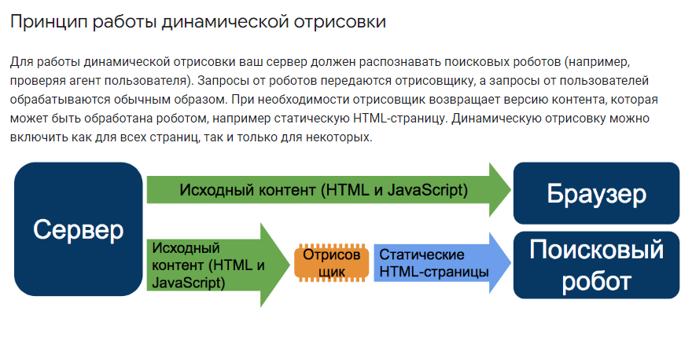

# SPA, PWA, SSG, SSR and SEO

::: details Web 1.0 -> Web 2.0

First there was static HTML and browsers showed it. A little bit later a little bit of JavaScript was invented to process forms and do a little animation. Then CSS came along and everyone saw that it was beautiful. Then someone proposed the idea of JSON for data format, and then Microsoft gave the world XMLHttpRequest, and JavaScript was allowed to send and receive data from the server.

That's how SPA was born.

:::

::: details SPA

SPA (Single Page Application) works like a regular desktop/mobile application - when first accessing the server, it receives the shell necessary to display the site, and then sends data to/from the server, usually in JSON format. This is much more efficient than the way when with each request from the server came a new HTML page with all the resources.

For the user UX increases significantly.

:::

::: details PWA

PWA (Progressive Web Application) is another step to improve user experience and make web applications as close as possible to native web applications.

With PWA, two elements are added to the SPA:

1. `Manifest`. A text file with the properties of the application. With this, the icon of the web application can be set as well as native applications to the home screen of the smartphone. In addition, when PWA is launched, it may not show browser elements and appear to be a normal application.

2. `Service worker`. This is a layer in the browser between the server and the browser itself that allows you to do managed caching. In other words, store the app with all the resources on the smartphone/computer so that when you start it, it will run immediately. If you don't need data from the server, the app can run offline (e.g. Notes).

You can read more about PWA on the website created by the Chrome team - [https://web.dev/](https://web.dev/progressive-web-apps/)

Upgrading SPA to PWA is very small in labor cost, but very significant in benefit. Developing SPA and not making it a PWA is like renting a luxury hotel room but sleeping on a mat at its entrance in the corridor because it's too lazy to walk to the bedroom.

:::

::: details PWA -> Workbox and vite-plugin-pwa

`Manifest` and `Service worker` are so simple that creating a wrapper over SW - `Workbox`, and a plugin for Vite - `vite-plugin-pwa` is not logical. You get several times more code, need to load additional dependencies and understand wrapper configurations. Simple things have been made complex.

It is better to use `Manifest` and `Service worker` as they were created originally, and write these two simple files using templates from the specifications.

:::

::: details SSG

SSG (Static Site Generation) is an approach where the content of a website is pre-generated into html files, which are then distributed from the server.

<!-- An example of this is VitePress and this site. -->

Immediately suitable for indexing by search engines.

:::

::: details SSR

SSR (Server Side Rendering), a way of generating html on the server side, when generation occurs at the moment of request.
After the client requests a page, the server executes API requests on its side and then generates the html page. Accordingly, the server needs a Node.js server, which is quite a heavy load on the hardware.

In addition, there are a lot of restrictions when writing code and using certain JavaScript and Vue features. As [Google writes](https://web.dev/rendering-on-the-web/) regarding SSR - _"A rehydration problem: one app for the price of two"_.

:::

::: details SEO optimization

In order for a search engine to index a page on your site, it must receive HTML with content (text, images, video) when accessing it. With SPA sites, where content is loaded dynamically by JavaScript, this is often not possible.

The most popular and inefficient method to bypass this is to use SSR (SSG is suitable for simple structured sites without backend, like documentation).

Google allows you to [see](https://search.google.com/test/mobile-friendly) how your site looks/indexed by its crawler, which somehow still works with scripts, so first check if you need to get complicated at all.

If you find problems, you can use [dynamic rendering](https://developers.google.com/search/docs/crawling-indexing/javascript/dynamic-rendering)

The point is to handle requests from normal users and search bots differently and give them different pages. For users - SPA, for search bots - pages generated on the fly or in advance. Distribution can be handled by a webserver or an entry point to your site (`index.php` instead of `index.html`).

The above picture implies some kind of Prerenderer (which are also available as a third-party service or their own solution), but in most cases it is much easier to generate HTML page for the bot directly.

That is, for example, for a product page in an online store it can be its text description with pictures and customer reviews in any HTML formatting. For this purpose it is enough a script on PHP/Express/Python, etc. in 100-200 lines, which is much less labor-intensive than SSR solutions, and also reduces the requirements in the server "hardware" by orders of magnitude (the output can be cached in a static HTML file).

When the actual content (text, images) of such a page coincides with the content of SPA in the browser, Google does not consider the simplified version for its bot as a deception. This method has been around since before the advent of SSRs. Verified by many years of use.

:::

::: details PageSpeed and other performance tests

[PageSpeed](https://pagespeed.web.dev/) and similar tools are very useful in identifying unoptimized places in your web application, but it is not quite right for SPA and PWA.

More precisely, some of its metrics don't take into account UX as a whole. A well-built PWA, when first downloaded and installed, will of course lose by FCP metrics to its SSR counterpart, but after placing all its resources locally on the client's browser, no SSR will come close to it in terms of speed and user comfort, not to mention other features like offline operation and installation as a native application.

SSR can probably be useful for some exceptional cases, but in general it looks like a dead-end branch in frontend development.

:::
